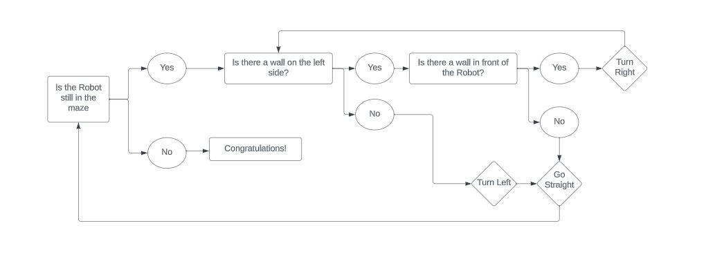

#  Solutions to the Pre-Interview Coding Questions 

## Question One: WordDictionary.java

Unit Tests included in WordDictionaryTest.java (Tested with JUnit 4.13)
Tests developed in VS Code and should be run **directly** from the test file instead of the terminal (the unfinished Robot class interferes with the normal execution)

## Question Two: RobotAlgo.js

No Unit Tests created as the Robot.java is a placeholder function.
Overall Logic for the implemented algorithm (Follow Left Wall)

## Question Three:  Refactoring.java

No Unit Tests, however the code has descriptive comments throughout. 